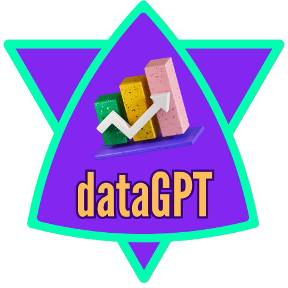

<p align="center">
  <a href="" rel="noopener">
 </a>
</p>

<h3 align="center">dataGPT para o Google Drive</h3>

<div align="center">

[]()
[](https://github.com/seuusuario/dataGPT/issues)
[](https://github.com/seuusuario/dataGPT/pulls)
[](/LICENSE)

</div>

---

<p align="center"> Uma aplicação Streamlit para visualizar dados do Google Sheets compartilhados via Google Drive.
    <br> 
</p>

## 📝 Table of Contents

- [About](#about)
- [Getting Started](#getting_started)
- [Deployment](#deployment)
- [Usage](#usage)
- [Built Using](#built_using)
- [TODO](../TODO.md)
- [Contributing](../CONTRIBUTING.md)
- [Authors](#authors)
- [Acknowledgments](#acknowledgement)

## 🧐 About <a name = "about"></a>

O dataGPT para o Google Drive permite visualizar dados compartilhados via Google Drive. 
Você pode inserir um link de compartilhamento de um arquivo Google Sheets, 
escolher as colunas para os eixos X e Y de um gráfico, e visualizar os dados e o gráfico interativamente.

## 🏁 Getting Started <a name = "getting_started"></a>

Estas instruções irão ajudá-lo a obter uma cópia do projeto em execução na sua máquina local para fins de desenvolvimento e teste. Consulte a seção [deployment](#deployment) para notas sobre como implantar o projeto em um sistema ao vivo.

### Prerequisites

As coisas que você precisa para instalar o software e como instalá-las.

```bash
pip install -r requirements.txt

## 🤝 Contributing <a name="contributing"></a>

Nós adoraríamos receber contribuições para o dataGPT! Existem várias maneiras de contribuir:

- Reportar bugs e abrir issues
- Sugerir novas funcionalidades
- Melhorar a documentação
- Enviar pull requests

### Reportando Problemas

Se você encontrar um bug ou tiver uma sugestão, por favor, abra uma [issue](https://github.com/seuusuario/dataGPT/issues) no repositório.

### Enviando Pull Requests

1. Faça um fork do repositório.
2. Crie uma branch para sua feature (`git checkout -b feature/nome-da-feature`).
3. Commit suas mudanças (`git commit -m 'Adiciona nova feature'`).
4. Envie para o branch (`git push origin feature/nome-da-feature`).
5. Abra um [Pull Request](https://github.com/seuusuario/dataGPT/pulls).

Para mais detalhes, veja o nosso [guia de contribuição](CONTRIBUTING.md).

## 📜 License

Distribuído sob a licença MIT. Veja `LICENSE` para mais informações.
